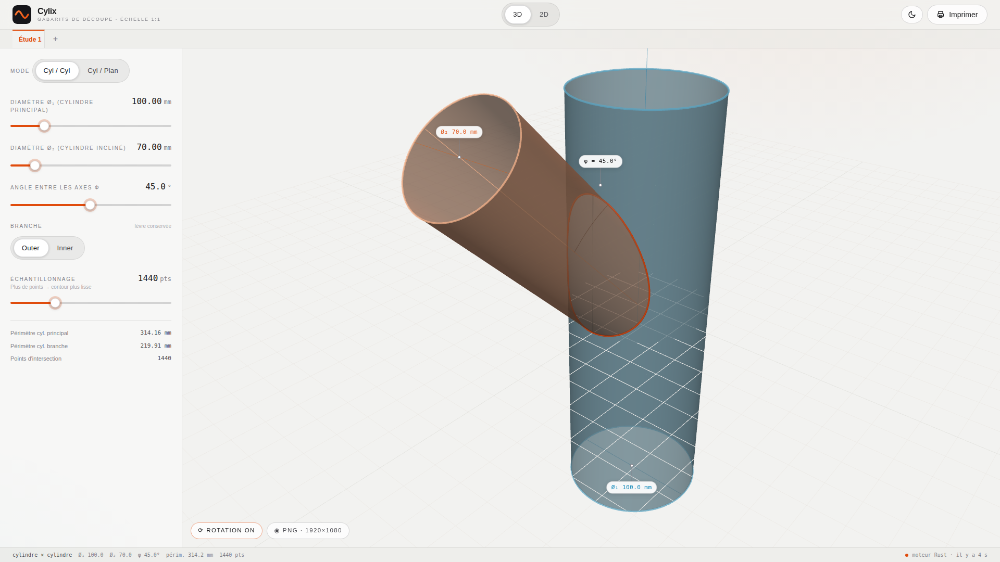
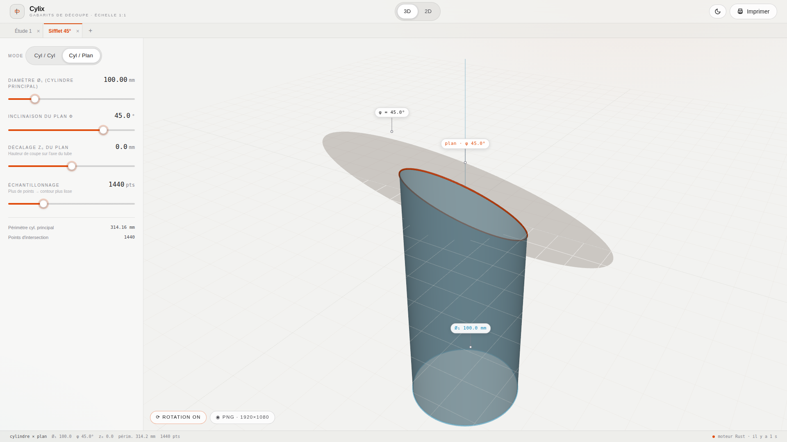
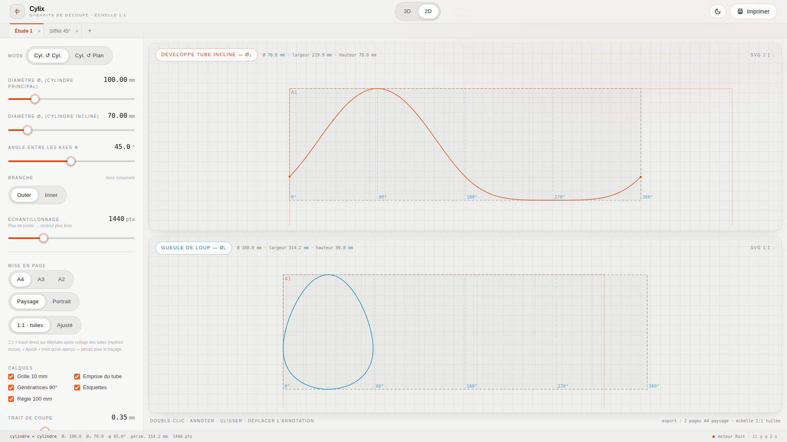
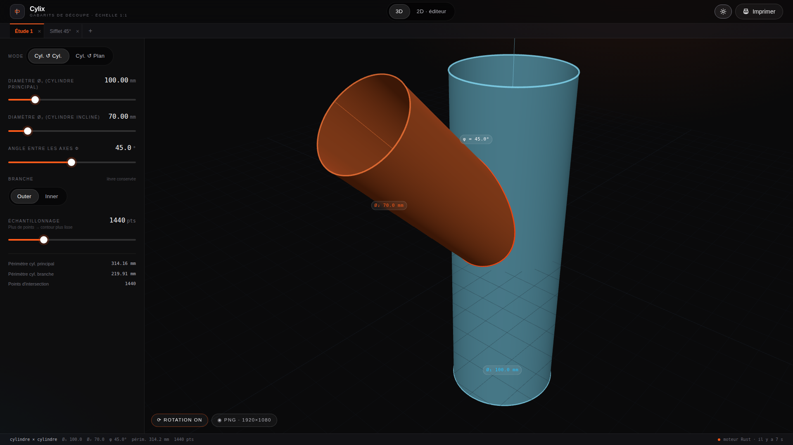

# Cylix — gabarits de découpe de cylindres à l'échelle 1:1

<br clear="left" />

*Moteur exact d'intersections de cylindres (gueule de loup, coupe en sifflet) et
outil de production des développés : deux mises à plat — une par cylindre —
annotables, exportées en PDF vectoriel tuilé 1:1 (à dérouler sur le tube et
couper directement) et en DXF pour la CAO/CNC.*

— **A. Verger**

---

> 📐 **Théorie complète** : la dérivation intégrale (discriminant en forme fermée,
> isométrie du développé, gueule de loup, cas limites de Steinmetz, bornes
> d'erreur de discrétisation) est dans **[`docs/THEORY.md`](docs/THEORY.md)** —
> document de référence du moteur, destiné à publication. Chaque équation est
> **vérifiée mécaniquement** (25 contrôles SymPy/NumPy) et le moteur Rust est
> validé contre la référence NumPy à < 2·10⁻¹³ mm : voir
> [`docs/verification/`](docs/verification/). L'application, elle, se contente
> de faire le boulot — la théorie vit dans la doc.

## Aperçu

Captures Full HD (1920×1080), prêtes pour les réseaux sociaux — dossier
[`docs/screenshots/`](docs/screenshots/) :

| | |
|---|---|
|  |  |
|  |  |

## 1) Théorie (version courte mais complète)

### Modèle géométrique

On travaille dans un repère orthonormé $(x,y,z)$.

**Cylindre 1** (*vertical*), axe $Oz$, rayon $R_1>0$ :

$$
x^2 + y^2 = R_1^2.
$$

**Cylindre 2** (*incliné*), rayon $R_2>0$, obtenu par rotation d’angle $\phi$ autour de l’axe $x$ d’un cylindre initialement coaxial à $Oz$.  
Paramétrisation **avant** rotation : $(R_2\cos\theta,\ R_2\sin\theta,\ t)$.  
Après la rotation $R_x(\phi)$ (autour de $x$), on obtient :

$$
\begin{aligned}
x(\theta,t) &= R_2\cos\theta,\\
y(\theta,t) &= R_2\sin\theta\cos\phi - t\sin\phi,\\
z(\theta,t) &= R_2\sin\theta\sin\phi + t\cos\phi.
\end{aligned}
$$

> *Remarque.* Pour $\phi=0$, le cylindre 2 redevient coaxial à $Oz$. Dans ce cas particulier, l’équation quadratique dégénère ($a=0$) et l’intersection est vide si $R_1\ne R_2$, ou bien un cercle de rayon $R_1$ si $R_1=R_2$.

### Cas particulier : cylindre × plan incliné

Quand le « cylindre 2 » dégénère vers un plan, on remplace l’équation $x^2+y^2=R_2^2$ par celle d’un plan d’inclinaison $\phi$ autour de $Ox$, passant par $(0,0,z_0)$ :

$$
y\sin\phi + z\cos\phi = z_0\cos\phi
\qquad\Longleftrightarrow\qquad
z(\theta) = z_0 - R_1\sin\theta\,\tan\phi.
$$

L’intersection est analytique : pour $\theta\in[0,2\pi)$, le point sur le cylindre 1 vaut $(R_1\cos\theta, R_1\sin\theta, z(\theta))$ et le développé sur le tube vertical est directement $(u,v) = (R_1\,\theta,\ z(\theta))$ — c’est la sinusoïde classique d’une **coupe d’onglet**. Aucun choix de branche n’est nécessaire.

### Condition d’intersection et équation en $t$

Un point du cylindre 2 appartient au cylindre 1 ssi $x^2(\theta,t)+y^2(\theta,t)=R_1^2$.  
En remplaçant $x$ et $y$ par les expressions ci-dessus, on obtient, pour chaque $\theta\in[0,2\pi)$, un **quadratique en $t$** :

$$
a\,t^2 + b(\theta)\,t + c_0(\theta)=0,
$$

avec

$$
\begin{aligned}
a &= \sin^2\phi,\\
b(\theta) &= -\,2\,R_2\,\sin\theta\,\cos\phi\,\sin\phi,\\
c_0(\theta) &= R_2^2\!\big(\cos^2\theta+\sin^2\theta\,\cos^2\phi\big)-R_1^2.
\end{aligned}
$$

Le **discriminant** $\Delta(\theta)=b^2(\theta)-4\,a\,c_0(\theta)$ décide de l’existence de solutions réelles. Dès qu’il existe des $\theta$ tels que $\Delta(\theta)\ge 0$, les deux surfaces se coupent. Les solutions sont

$$
t_\pm(\theta)=\frac{-\,b(\theta)\pm\sqrt{\Delta(\theta)}}{2a}\qquad(\phi\ne 0).
$$

### Deux branches (« outer » / « inner »)

Pour une génératrice donnée ($\theta$ fixé), il y a en général **deux points** d’intersection — « entrée »/« sortie ». En balayant $\theta$, cela engendre **deux courbes**.  
Dans le code, on choisit la branche via `branch="outer"` (racine $+$) ou `branch="inner"` (racine $-$). **En fabrication**, on n’utilise généralement **qu’une seule lèvre** (souvent `outer`).

### Développés (mises à plat)

Le développement isométrique d’un cylindre de rayon $R$ vers le plan se fait via la carte $(\theta,v)\mapsto(u,v)$ avec

$$
u = R\,\theta,\qquad v = \text{coordonnée axiale (inchangée)}.
$$

On en déduit :

**(i) Gabarit sur le cylindre incliné (tube à couper)**

$$
\big(u_2(\theta),\,v_2(\theta)\big)=\big(R_2\,\theta,\ t_\star(\theta)\big),
$$

où $t_\star$ désigne l’une des deux branches $t_\pm$.

**(ii) « Gueule de loup » sur le cylindre vertical**

On passe en cylindriques du cylindre 1 : $\alpha=\mathrm{atan2}(y,x)$ et $z=z$, puis

$$
(u_1,v_1)=\big(R_1\,\alpha^\uparrow,\ z\big),
$$

où $\alpha^\uparrow$ est l’angle **déroulé** (*unwrap*) pour supprimer le saut à $2\pi$.

> Les deux courbes 2D, **à l’échelle 1**, servent de gabarits : l’une pour **découper** le tube incliné, l’autre pour **présenter** le tube vertical (contact « fish-mouth »).

---

## 2) Cylix — l'application (Rust + Svelte)

Application-outil plein écran : moteur géométrique en **Rust** (Axum + nalgebra),
interface **Svelte 5 + Tailwind 4** servie en SPA, vue 3D **Three.js**.

* **Thème clair par défaut** (précision atelier) et thème sombre « mission
  control » en un clic — toute l'interface, les canvases 2D, la scène 3D et la
  capture PNG suivent le thème.
* **Layout outil** : paramètres à gauche, viewport central, bascule **3D ↔ 2D**,
  barre de statut ; **études en onglets** (multi-études, renommage au double-clic,
  copie des paramètres courants, persistance locale) — comme dans pilegroupx.
* **Mode Multi tube** : N tubes (Ø, position z, inclinaison φ,
  azimut ψ) sur un même tube principal. Chaque piquage est coupé au **premier
  contact** — tube principal *ou piquage voisin* : la **couture mutuelle**
  entre tubes qui se rencontrent avant le longeron est calculée en formules
  fermées et portée sur les gabarits. Le développé du principal porte
  **toutes les lumières** positionnées (azimut → décalage horizontal exact) ;
  chevauchements détectés et signalés.
* **Vue 3D fidèle à la pièce** : chaque cylindre **s'arrête à l'intersection** —
  le tube incliné est maillé jusqu'à son premier contact avec le gros tube
  (selon la lèvre outer/inner choisie), le cylindre principal est percé de la
  lumière exacte, le sifflet est tronqué au plan avec son chapeau elliptique.
  Matériaux pastel légèrement translucides, courbe d'intersection en tube
  émissif, axes, **arc d'angle φ**, **annotations à lignes de rappel** (point
  d'ancrage + chip) avec lignes de diamètre sur les rives ; orbite, rotation
  auto, capture **PNG 1920×1080** (annotations et rappels composés dans
  l'image).
* **Vue 2D — les deux mises à plat** : l'intersection développée **sur chaque
  cylindre** (gabarit du tube incliné = courbe ouverte sur la période complète,
  gueule de loup = contour fermé), calques (grille 10 mm, emprise, génératrices
  90°, étiquettes, règle), **annotations** ajoutées au double-clic et déplacées
  à la souris, cartouche, mise en page A4/A3/A2.
* Export **PDF vectoriel mm-exact** : échelle **1:1 tuilée** avec repères de
  collage (tuiles A1, B1, …) — à dérouler sur le tube et couper directement —
  cartouche et règle de contrôle 100 mm ; ou mode « ajusté » pour aperçu.
  Le tuilage couvre **l'emprise de la courbe** (pas le périmètre déroulé
  entier) et **les pages vides sont supprimées** : chaque feuille imprimée
  porte du trait de coupe. L'aperçu 2D affiche exactement les tuiles émises.
* Export **DXF R12** (calques `CUT` / `FRAME` / `AXIS` / `TEXT` / `ANNOT`, mm)
  pour AutoCAD, QCAD, LibreCAD et chaînes CAM laser/plasma.
* Export **STL binaire** (mm) : la maquette 3D exacte de l'assemblage —
  tube principal percé de ses lumières, piquages coupés (coutures mutuelles
  comprises), sifflet tronqué — maillée depuis les mêmes formules fermées
  que les gabarits. À importer dans **Fusion 360** / FreeCAD.
* Export **SVG 1:1** par mise à plat, impression navigateur 1:1.

**Feuille de route** : épaisseur de paroi paramétrable dans l'export STL
(solides fermés).

### 2.1 Pré-requis

| Outil       | Version testée |
|-------------|----------------|
| Rust        | 1.94 +         |
| Node        | 22 +           |
| npm         | 10 +           |

### 2.2 Build complet

```bash
# 1) compiler la SPA (génère web/dist, embarquée dans le binaire)
cd web && npm install && npm run build && cd ..

# 2) compiler le binaire Rust (statique, ~15 Mo en release)
cargo build --release

# 3) lancer
./target/release/cylix --port 8787
# puis ouvrir http://127.0.0.1:8787
```

Le binaire accepte aussi `--host 0.0.0.0` pour écouter sur l’ensemble des interfaces (utile en LAN).

### 2.3 Développement

```bash
# terminal 1 — backend Rust
cargo run --release -- --port 8787

# terminal 2 — frontend en hot-reload, proxy /api -> :8787
cd web && npm run dev
# Vite démarre sur http://127.0.0.1:5173
```

### 2.4 Endpoints HTTP

| Méthode | Route                          | Corps                                              | Réponse                |
|---------|--------------------------------|----------------------------------------------------|------------------------|
| `GET`   | `/api/health`                  | —                                                  | `{name, version, uptime_ms}` |
| `POST`  | `/api/intersect/cyl-cyl`       | `{r1, r2, phi, n_samples?, branch?}`               | `IntersectionPayload`  |
| `POST`  | `/api/intersect/cyl-plane`     | `{r1, phi, z0?, n_samples?}`                       | `IntersectionPayload`  |
| `POST`  | `/api/export/pdf`              | `ExportDocument` (cf. ci-dessous)                  | `application/pdf`      |
| `POST`  | `/api/export/dxf`              | `ExportDocument`                                   | `application/dxf` (R12)|

`ExportDocument` — le modèle produit par l'atelier d'export (le backend recalcule
la géométrie depuis `source`, seule source de vérité) :

```jsonc
{
  "source":   { "mode": "cyl_cyl", "r1": 50, "r2": 35, "phi": 0.785, "n_samples": 1440, "branch": "outer" },
  "page":     { "format": "a4" | "a3" | "a2", "orientation": "portrait" | "landscape", "margin_mm": 10 },
  "scale":    "one_to_one" | "fit",          // 1:1 tuilé  |  ajusté 1 page
  "layers":   { "grid": true, "frame": true, "axis": true, "labels": true, "scale_bar": true },
  "title_block": { "title": "", "project": "", "author": "", "date": "", "notes": "" },
  "annotations": [{ "pattern": "branch" | "main", "u": 30, "v": 10, "text": "…", "size_mm": 4 }],
  "patterns": ["branch", "main"],
  "cut_width_mm": 0.35
}
```

`IntersectionPayload` :

```jsonc
{
  "mode": "cyl_cyl" | "cyl_plane",
  "r1": 50.0, "r2": 35.0, "phi": 0.7853, "branch": "outer",
  "curve3d":     [{ "x": ..., "y": ..., "z": ... }, ...],
  "dev_branch":  [{ "theta": ..., "u": ..., "v": ... }, ...],
  "dev_main":    [...] | null,
  "bbox_branch": { "u_min":..., "u_max":..., "v_min":..., "v_max":... },
  "bbox_main":   {...} | null,
  "circumference_branch": 219.91,
  "circumference_main":   314.16
}
```

* Toutes les longueurs sont en **millimètres**.
* Les angles sont en **radians**.
* `branch ∈ {"outer", "inner"}` choisit la racine $t_\pm$ (cf. §1).
* `dev_main` n’est renvoyé qu’en mode `cyl_cyl`.

Exemple de requête `curl` :

```bash
curl -s -X POST http://127.0.0.1:8787/api/intersect/cyl-cyl \
  -H 'Content-Type: application/json' \
  -d '{"r1": 50, "r2": 35, "phi": 0.7853981633974483, "n_samples": 1440, "branch": "outer"}'
```

### 2.5 Impression 1 : 1

* Le bouton **« Imprimer 1 : 1 »** déclenche `window.print()`. Le CSS d’impression masque l’UI et ne laisse visibles que les gabarits sur fond blanc.
* Chaque SVG est dimensionné en `mm` (`width="…mm"`, `viewBox` identique). Le pilote d’impression doit être réglé sur **« Échelle réelle »** / **« 100 % »** / **« Actual size »** ; désactiver l’option « ajuster à la page ».
* Une **règle de 100 mm** est imprimée en bas de chaque feuille pour valider l’étalonnage après impression. Si elle ne mesure pas exactement 100 mm une fois sur papier, ajuster le pilote.

Exports disponibles depuis chaque carte :

| Format | Usage                                                            |
|--------|------------------------------------------------------------------|
| `PDF`  | Impression 1:1 tuilée multi-pages (repères de collage) ou aperçu ajusté — vectoriel, généré par le backend |
| `DXF`  | AutoCAD, QCAD, LibreCAD, chaînes CAM laser/plasma — R12, calques dédiés, mm |
| `SVG`  | LightBurn, RDWorks, Inkscape, Illustrator, Fusion 360, Onshape — vectoriel pur |
| `CSV`  | Colonnes `theta_rad, u_mm, v_mm` — intégration dans un post-processeur CNC |
| `PNG`  | Capture 3D 1920×1080 (bouton dans la vue 3D) — communication / réseaux sociaux |

### 2.6 Arborescence

```
cylinders-intersection/
├── Cargo.toml              # crate cylix
├── docs/
│   ├── THEORY.md           # dérivation mathématique complète (référence, papier)
│   ├── verification/       # preuves mécaniques : SymPy + croisement Rust/NumPy
│   └── screenshots/        # captures Full HD 1920×1080 (réseaux sociaux)
├── src/
│   ├── geometry.rs         # rotation X, paramétrisation cyl-2, BBox, unwrap
│   ├── intersection.rs     # cyl/cyl + cyl/plan + développés (gueule de loup)
│   ├── export/
│   │   ├── mod.rs          # modèle ExportDocument, layout, plan de tuilage
│   │   ├── pdf.rs          # writer PDF vectoriel maison (mm-exact, WinAnsi)
│   │   └── dxf.rs          # writer DXF R12 ASCII (calques CUT/FRAME/AXIS/…)
│   ├── api.rs              # routes Axum + SPA fallback
│   ├── assets.rs           # rust-embed sur web/dist
│   ├── lib.rs              # re-exports
│   └── main.rs             # serveur Axum (CLI clap)
└── web/                    # SPA Cylix (Svelte 5 + Tailwind 4 + Three.js)
    ├── src/
    │   ├── App.svelte                  # layout outil : header, onglets, sidebar, viewport
    │   ├── main.ts
    │   ├── app.css
    │   ├── components/
    │   │   ├── Header.svelte           # brand + bascule 3D/2D + impression
    │   │   ├── StudyTabs.svelte        # études en onglets (multi-études)
    │   │   ├── ControlPanel.svelte     # géométrie + (en 2D) panneau export
    │   │   ├── ExportPanel.svelte      # page, calques, cartouche, annotations, PDF/DXF
    │   │   ├── Viewer3D.svelte         # Three.js annoté : Ø₁/Ø₂, arc φ, PNG 1080p
    │   │   ├── Studio2D.svelte         # les deux mises à plat empilées
    │   │   ├── PatternCanvas.svelte    # un développé : calques, tuiles, annotations
    │   │   ├── StatusBar.svelte        # résumé géométrie + battement moteur
    │   │   ├── PrintLayout.svelte      # rendu impression 1:1
    │   │   ├── Slider.svelte
    │   │   └── Segmented.svelte
    │   └── lib/
    │       ├── api.ts
    │       ├── export.ts               # modèle ExportDocument (miroir TS) + tuilage
    │       ├── editor.svelte.ts        # façade éditeur sur l'étude active
    │       ├── store.svelte.ts         # multi-études + persistance + calcul
    │       └── svg.ts
    ├── vite.config.ts
    ├── tsconfig.json
    └── index.html
```

### 2.7 Validation numérique

Tests unitaires Rust :

```bash
cargo test --release
```

Cas couverts :

* **Cylindres égaux à 90°** — la racine `outer` doit atteindre le maximum $v=R_1$ ($\pm 10^{-6}$).
* **Plan à 45° sur un tube Ø 60 mm** — l’abscisse couvre la totalité de $2\pi R_1$ (à un pas d’échantillonnage près).
* **Module export** — emprise = périmètre exact, plan de tuilage minimal et suffisant,
  étiquettes de tuiles A1/B2/…, erreurs propres pour motifs indisponibles.
* **PDF** — squelette structurel valide (catalog, xref pointant octet par octet sur les
  objets), une page par motif en mode ajusté, tuiles en 1:1, échappement WinAnsi
  (accents, parenthèses, °).
* **DXF** — sections HEADER/TABLES/ENTITIES bien formées, `POLYLINE`/`SEQEND` appariés,
  drapeau « fermé » sur les contours fermés, sortie 100 % ASCII.

### 2.8 Script Python historique (legacy)

Le script de référence `tubes_intersection_and_unwrap.py` reste fourni pour comparaison ou usage en notebook. Il implémente la même algèbre que le backend Rust (cas cyl/cyl uniquement). Dépendances : `numpy`, `matplotlib`.

```bash
pip install numpy matplotlib
python tubes_intersection_and_unwrap.py     # exemple d'exécution intégré
```

---

## 3) Notes de validité et cas limites

* Pour $\phi=0$, l’équation quadratique **dégénère** ($a=0$) : on retombe sur deux cylindres coaxiaux. L’intersection est un cercle seulement si $R_1=R_2$. Le backend renvoie alors un payload vide (sans erreur) ; l’UI affiche « Pas d’intersection valide ».
* Pour le mode plan, $\phi$ doit rester strictement dans $(-\pi/2,\,\pi/2)$ : à $\pm\pi/2$ le plan devient parallèle à l’axe du cylindre. Le backend rejette ce cas avec un `400 Bad Request`.
* Les formules de $a$, $b(\theta)$, $c_0(\theta)$ ci-dessus proviennent de l’égalité $x^2+y^2=R_1^2$ avec
  $x=R_2\cos\theta$, $y=R_2\sin\theta\cos\phi - t\sin\phi$. On a bien
  $$x^2+y^2=R_2^2\cos^2\theta+R_2^2\sin^2\theta\cos^2\phi-2R_2\sin\theta\cos\phi\sin\phi\,t+\sin^2\phi\,t^2,$$
  d’où le quadratique annoncé.
* La **branche** (`outer` / `inner`) sélectionne la lèvre supérieure ou inférieure de l’intersection. En tuyauterie la « gueule de loup » conserve presque toujours `outer` ; `inner` sert pour les pénétrations à recouvrement.
* Le développé sur le cylindre principal utilise un `unwrap` analogue à `numpy.unwrap` pour supprimer le saut de $\pm\pi$ de `atan2` et obtenir un tracé continu sur $[-\pi R_1, \pi R_1]$.

---

*Document de référence + manuel de la webapp.*

— **A. Verger**
